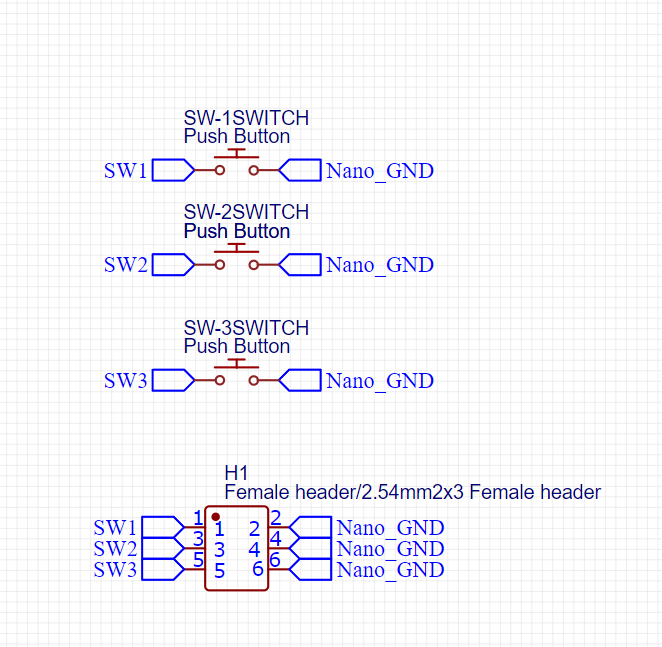
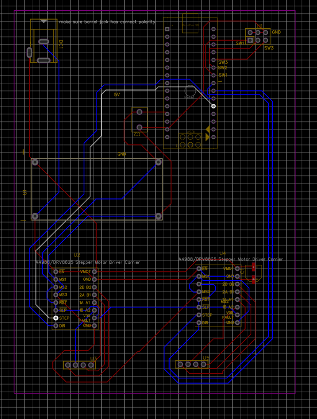

# August 22nd: Started finding components for PCB

My goal was to ensure that the components were as cheap as possible, after all, I wanted to reduce the cost of the final product. It was mainly just me searching stuff up meticulously on Aliexpress, and also researching on what parts to make since I'm still fairly new to electronics; this is my 3rd project. The
prototype built during undercity used completely different components than what I decided for this iteration
mainly because of the restricted materials available then. 

Here is a list of the materials (screenshots of my google doc for planning b/c I don't like planning in markdown)

**Total time spent: 2.5 hrs**

 
 

 
 

# August 25th: Created Schematic

I used Kicad to create the schematic. I decided to represent the DC motor encoder with a 1x4 connector because it was essentially the same thing even though the encoder itself was attached to the motor. It didn't matter since in the actual PCB it was all going to be connected by jumper wires, so no copper padding for most things besides the arduino clone, driver, and switches. This took me a while because it's the 2nd schematic I've created with Kicad and the 3rd schematic I've created overall (I made a project using EasyEDA).

**Total time spent: 3 hrs**
 

 
 

# August 26th: Created PCB

Finding footprints is probably my least favorite thing about hardware projects and it took me a frustrating amount of time....
My main concern with the PCB was actually the placment of the buttons. I wanted the buttons to physically be at the top of the folder like the prototype, but the issue is that in the prototype there were 2 breadboards. For the purposes of grounded, only one PCB is sponsored. So I decided that buttons would be on one side of the PCB and the rest of the bulky components would be on the otherside (so protrusions in the case wouldn't be needed to accomodate the other components). The drivers and nano had so many connections that it was actually fairly challenging to wire everything on the chip.

**Total time spent: 4 hrs**

 
 

# August 28th: Scrapped current design and found new set of components

I realized that the JLC DC motors were no where near powerful enough after I tested one that my friend had. I had to switch the entire design to revolve around stepper motors. Furthermore, I decided to use a wall adapter because 2 9V batteries had too much internal resistance thus rendering them much less effective than I thought (this was part of the initial design mainly because wall adapters are sooo expensive!!) and they ran out too quickly if I were to switch to NEMA 17 steppers. This entire change required another voltage converter to be bought so I could power the arduino nano from the wall adapter as well, and I had to switch the dual driver over to 2 stepper drivers. Furthermore, I found that buying directly from the manufacturer, in the case of NEMA 17 steppers, was WAYYYYY cheaper than buying the stuff from Aliexpress.

**Total time spent: 2.5 hrs**

 
 

# August 29th: Schematic v2

This time I decided to switch to EasyEDA. In V1 I chose Kicad mainly because the switches would be easier to find (I'm using a unique sized switch from aliexpress that I've previously downloaded the library in Kicad) but then I realized that the JLCPCB and LCSC pipeline with EasyEDA would make my life a lot easier. I wasn't too familiar with the use of buck converters since now I had the wall adapter (I still have to supply power to the arduino nano at around 5V) so fingers crossed that I've wired this correctly otherwise I'm about to fry everything.

**Total time spent: 3 hrs**

 
 

# September 3rd: Footprint editing

While designing the PCB, I wanted it to be as easy to assemble as possible. Which is why I wanted to add custom footprints with female pin headers for JLCPCB assembly. That way all the components I buy could just "snap" onto the PCB board without the need for any soldering (of course the pin headers would need to be soldered but it would make my components replaceable!). However I ran into some major issues. Because I was using the absolute cheapest components I could find (of course I made sure there were still a sizable number of reviews) I couldn't really find datasheets online which the exact specifications. For example I wasnt't too sure of the width of the nano clone and a bunch of other smaller issues, like there being no good way to attach the buck converter since it was through hole to through hole (male pin headers wouldn't work b/c too many amps AND there was only one through hole on each corner of the buck converter). I could have used screw terminals and wires but I was very adamant about this part of the pcb being whole because I just decided to have the 3 buttons for toilet paper thickness to a separate PCB at the top of the machine. Even worse, when I finally did obtain all my footprints, a lot of them got jangled. I think I got lucky the first 2 times using software like EasyEDA because all the pins from the schematic and footprints perfectly matched so I didn't bother checking this time around, much to my detriment.  

One of my attempts to make footprints in EasyEDA:

Here are the messed up pins:

**Total time spent: 3 hrs**

# September 11th: Finished 1st PCB

I realized that I didn't actually know which pin is positive or negative on the barrel jack. After 45 minutes of trying to dig for the barrel jack company's data sheets, I gave up and switched to one that was 3 times more expensive on Aliexpress but I knew the polarity of. Unfortunately there was only one person to have bought it before so I'm hoping I don't get fleeced. The rest was pretty smooth sailing. I made sure the dimensions of the PCB where slightly smaller than the 3d printed box. This PCB contains all the components EXCEPT for the 3 switches, which will be a separate PCB that I'll make tomorrow.

**Total time spent: 2.5 hrs**

# September 12th: Finished 2nd (button) PCB

**Total time spent: 0.75 hrs**

# September 13th: Downsized 1st PCB

**Total time spent: 0.5 hrs**
