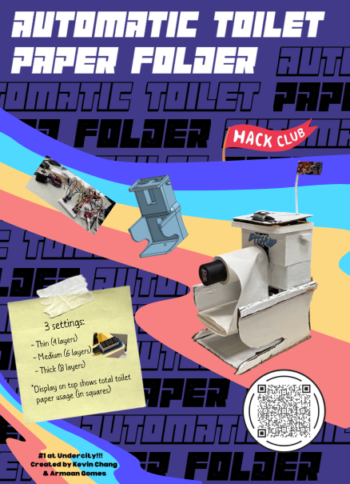
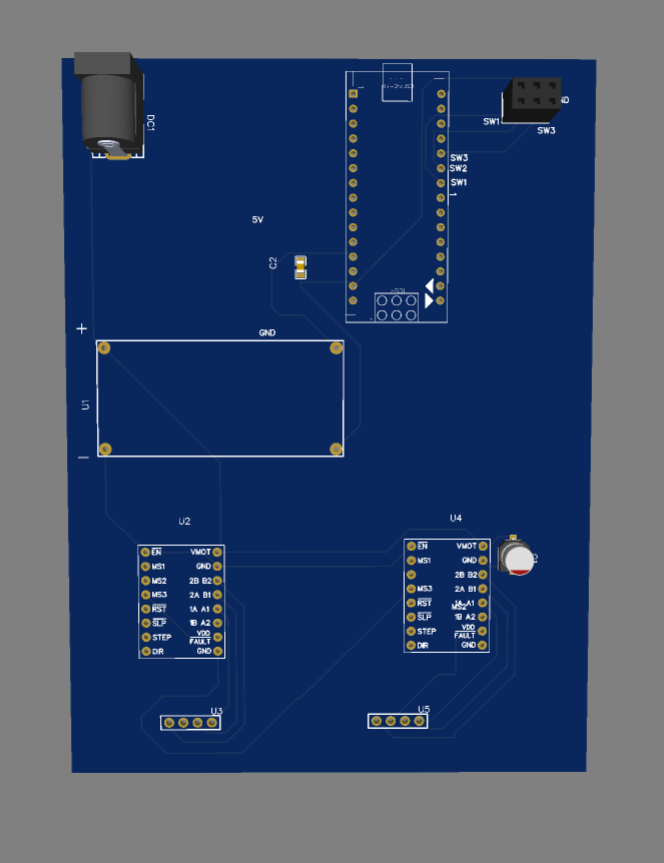
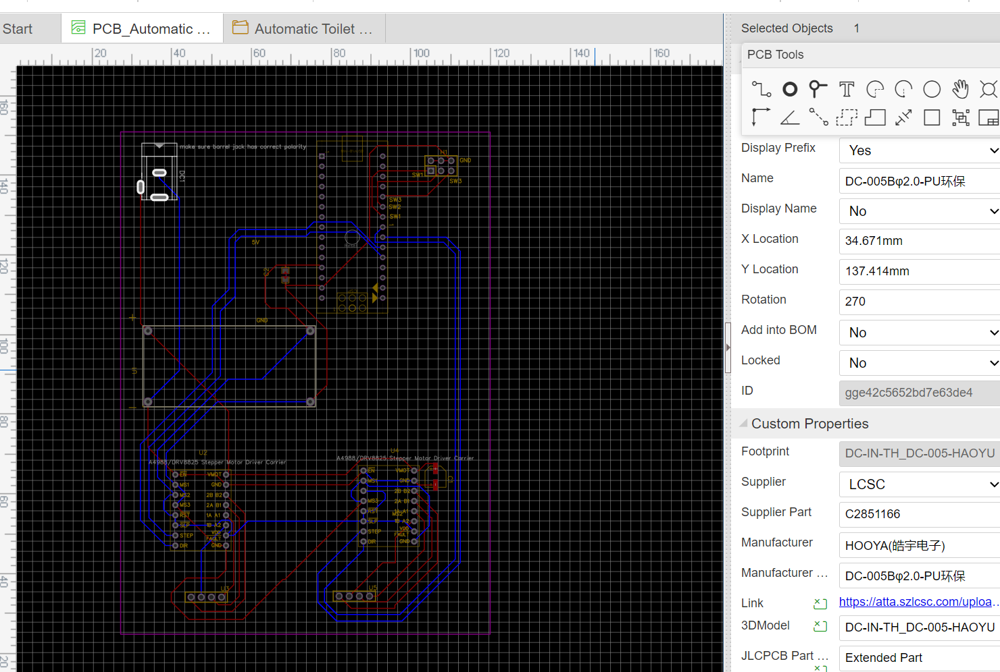
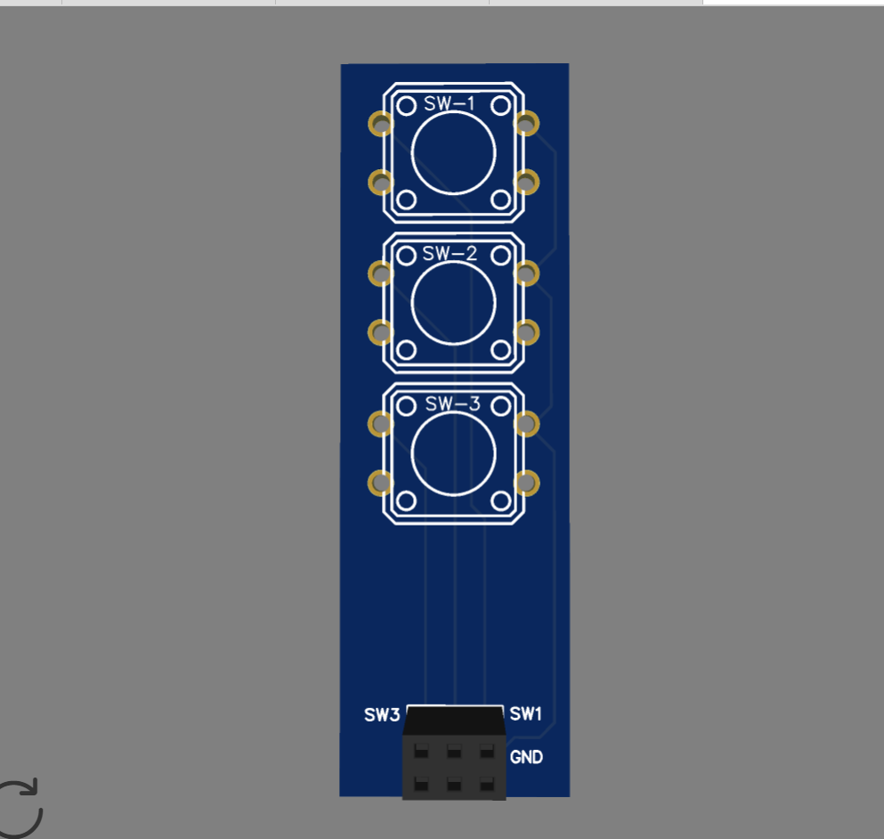
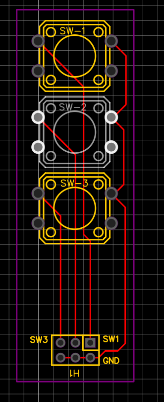

Automatic Toilet Paper Folder (V2)
The name is quite self explanatory --> It's 2025, why are we still folding our own toilet paper? This is version 2, built to be a streamlined product *V1 was created during Highway to Undercity (and won 1st place!)

Rendered PCB images:

Main PCB:

Buttons:

